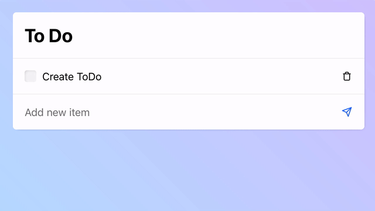

# To Do List

An example of how to do a simple todo list with React:

This is my latest startup! Just kidding, it's just a small personal project. I made this because:

- It's the perfect demo for my rapid-prototyping library **[`statux`](http://github.com/franciscop/statux)**, go check it out! 🎉
- I have started several side projects recently without finishing them so I wanted to _publish something_. Mission accomplished!
- My friend is learning programming, so this is a nice example for the UI and features that are beginner-friendly.

I've come a long way since I started learning React, which I deeply disliked in the beginning. Now I've moved to hooks and pure functions, switched to Styled Components and couldn't be happier!

I think the code is pretty clean and I really like structuring it this way for tiny projects. This is a good example of how to keep small projects lean.
